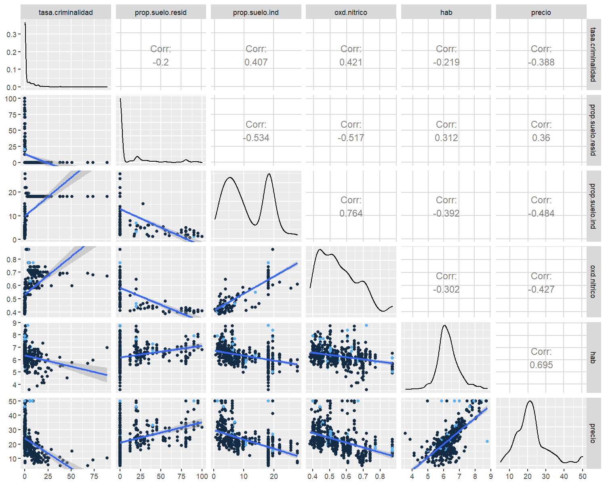
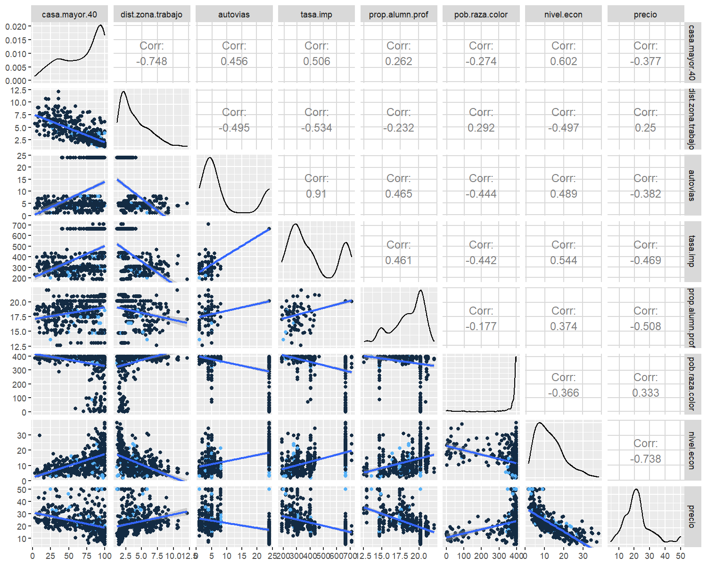
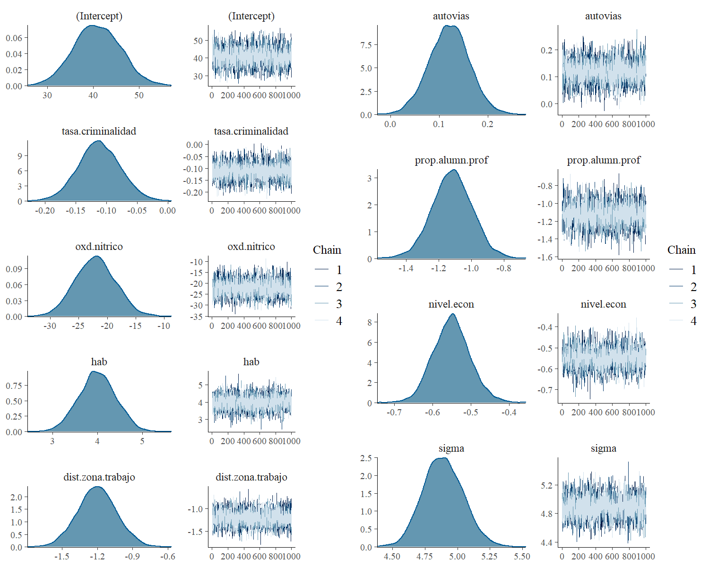
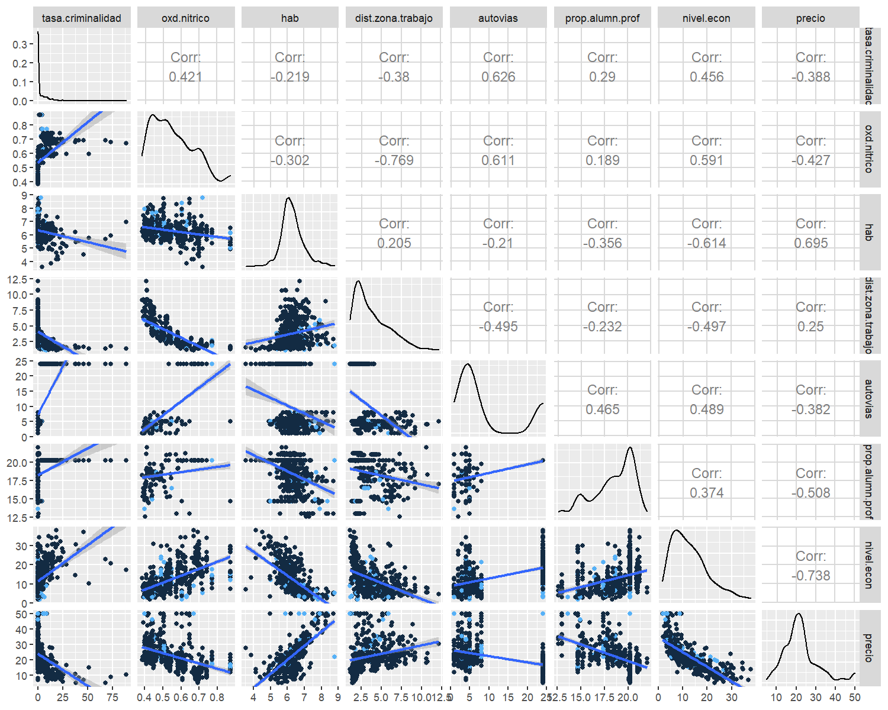

Bayesian neuronal networks
==================

This repository is a copy of my research in bayesian neuronal networks and have some implementations using Stan


``` r
library(bayesplot)
library(gridExtra)
library(rstanarm)
library(ggplot2)
library(GGally)
library(rstan)

load("~/UNICAN/Redes Neuronales/data/datHousing.Rdata")
```

Data Description
================

The used data is Housing, it contains the register of the house prices
in mu of 596 different houses, with 14 descriptive variables listed
above:

-   *tasa.criminalidad*: Criminality rate

-   *prop.suelo.resid*: Residencial land proportion

-   *prop.suelo.ind*: Industrial land proportion Proporción de suelo
    industrial

-   *rio*: river indicator

-   *oxd.nitrico*: Nitric oxide concentration

-   *hab*: average rooms number

-   *casa*: porportion of house older than 40 years

-   *dist.zona.trabajo*: distance to the work place

-   *autovias*: highways accessibility

-   *tasa.imp*: real state tax rate

-   *prop.alumn.prof*: Proportion of professor and students

-   *pob.raza.color*: total number of color people

-   *nivel.econ*: lower economic level

-   *precio*: House prices

The intereseted variable is *precio* the rest of them are descriptive
variables, *precio* variable doesnt have normal distribution (*see fig1 [7,7]*). 
The variable rio will be not considered in the model because
93% of the registers are not close to a river, therefore does not
provides significant information.

``` r
summary(dat$precio)
#>    Min. 1st Qu.  Median    Mean 3rd Qu.    Max. 
#>    5.00   17.02   21.20   22.53   25.00   50.00
```

Figure 1, provides densities, correlations, and scatter plots of the
first 6 variables, and precio variable. As it is shown, *habs* is the
most correlated one in terms of *precio* (*[7,5]*). The variables
*tasa.criminalidad* and *prop.suelo.resid* seems to have an exponential
behavior, and *prop.suelo.ind* seem to have multimodality, this could
affect the stability of our proposed models. Therefore if they do not
significantly contribute to our model, they will be not considered.

``` r
g1 = ggpairs(lower = list(continuous = "smooth",combo = "facetdensity",mapping = aes(color = rio)),columns = c(1,2,3,5,6,14),data = datHousing)
g1
```



In the second set of variables, *dist.zona.trabajo* on the contrary of
what it's expected has a low correlation with *precio*, and
*pob.raza.color* has a growing exponential behavior. *autovias* and
*tasa.imp* are highly correlated, therefore, one of them will be removed
to avoid colinearity.

``` r
g2 = ggpairs(lower = list(continuous = "smooth",combo = "facetdensity",mapping = aes(color = rio)),columns = c(7:14),
             data = datHousing)
g2
```



Initial model: Bayesian regresion
---------------------------------

This model is a simple linear regression where each explanatory variable
affects only the price variable, it is assumed that the response
variable is distributed normally with unknown mean and variance,
therefore, the model is as follows:

$$precio \sim normal(\alpha + \sum_{i=1}^{13}\beta_i X_i, \sigma^2)$$

Where: $\alpha$, $\sigma$ y las $\beta_i$ are unkown variables, the $X_i$ represent the 13 explanatory variables of the Housing data. Given that we do not have additional information 
to the model, the chosen prioris will be uninformative that adapt to the geometry of the parametric space. 

$$\alpha \sim student\_t(0,4,5)$$ 
$$\sigma \sim student\_t(0,4,5)$$
$$\beta_i \sim normal(0,5)$$

To estimate the posteriors a Hamiltonian Monte Carlo is used, for every
simulation 4 chains of 2000 iterations each, with a warm up of 1000 are
performed. Therefore, the fitted model is:

``` r
mod1 = stan_glm(precio ~ ., data = dat,  chains = 4,
           prior_intercept = student_t(4,0,5),
           prior = normal(0,5),
           prior_aux = student_t(4,0,5)
           
)
mod1
```

    #> stan_glm
    #>  family:       gaussian [identity]
    #>  formula:      precio ~ .
    #>  observations: 506
    #>  predictors:   13
    #> ------
    #>                   Median MAD_SD
    #> (Intercept)        36.9    5.1 
    #> tasa.criminalidad  -0.1    0.0 
    #> prop.suelo.resid    0.0    0.0 
    #> prop.suelo.ind      0.0    0.1 
    #> oxd.nitrico       -17.5    3.9 
    #> hab                 3.8    0.4 
    #> casa.mayor.40       0.0    0.0 
    #> dist.zona.trabajo  -1.5    0.2 
    #> autovias            0.3    0.1 
    #> tasa.imp            0.0    0.0 
    #> prop.alumn.prof    -1.0    0.1 
    #> pob.raza.color      0.0    0.0 
    #> nivel.econ         -0.5    0.1 
    #> 
    #> Auxiliary parameter(s):
    #>       Median MAD_SD
    #> sigma 4.8    0.2   
    #> 
    #> ------
    #> * For help interpreting the printed output see ?print.stanreg
    #> * For info on the priors used see ?prior_summary.stanreg

There are som variables that are not significant to the model such as:
proporciones de suelo residual(2) e industrial(3), tasa de impuesto
inmobiliario(9), porcentaje de casas mayores a 40 años(6), poblacion de
color(11). 


``` r
dat1 = datHousing[,-c(2,3,7,10,12)]
mod1 = stan_glm(precio ~ ., data = dat1, chains = 4,
                prior_intercept = student_t(4,0,5),
                prior = normal(0,5),
                prior_aux = student_t(4,0,5) )
mod1
```

    #> 
    #> Model Info:
    #>  function:     stan_glm
    #>  family:       gaussian [identity]
    #>  formula:      precio ~ .
    #>  algorithm:    sampling
    #>  sample:       4000 (posterior sample size)
    #>  priors:       see help('prior_summary')
    #>  observations: 506
    #>  predictors:   9
    #> 
    #> Estimates:
    #>                     mean   sd    10%   50%   90%
    #> (Intercept)        40.9    5.0  34.4  40.8  47.3
    #> tasa.criminalidad  -0.1    0.0  -0.2  -0.1  -0.1
    #> rio                 3.1    0.9   1.9   3.1   4.2
    #> oxd.nitrico       -22.1    3.5 -26.6 -22.1 -17.5
    #> hab                 4.0    0.4   3.5   4.0   4.5
    #> dist.zona.trabajo  -1.2    0.2  -1.4  -1.2  -1.0
    #> autovias            0.1    0.0   0.1   0.1   0.2
    #> prop.alumn.prof    -1.1    0.1  -1.3  -1.1  -1.0
    #> nivel.econ         -0.6    0.0  -0.6  -0.5  -0.5
    #> sigma               4.9    0.2   4.7   4.9   5.1
    #> 
    #> Fit Diagnostics:
    #>            mean   sd   10%   50%   90%
    #> mean_PPD 22.5    0.3 22.1  22.5  22.9 
    #> 
    #> The mean_ppd is the sample average posterior predictive distribution of the outcome variable (for details see help('summary.stanreg')).
    #> 
    #> MCMC diagnostics
    #>                   mcse Rhat n_eff
    #> (Intercept)       0.1  1.0  3218 
    #> tasa.criminalidad 0.0  1.0  4622 
    #> rio               0.0  1.0  4646 
    #> oxd.nitrico       0.1  1.0  3162 
    #> hab               0.0  1.0  4381 
    #> dist.zona.trabajo 0.0  1.0  3843 
    #> autovias          0.0  1.0  3461 
    #> prop.alumn.prof   0.0  1.0  4183 
    #> nivel.econ        0.0  1.0  3785 
    #> sigma             0.0  1.0  4656 
    #> mean_PPD          0.0  1.0  4597 
    #> log-posterior     0.1  1.0  1821 
    #> 
    #> For each parameter, mcse is Monte Carlo standard error, n_eff is a crude measure of effective sample size, and Rhat is the potential scale reduction factor on split chains (at convergence Rhat=1).

The credible intervals shows that variables such as: the proportions of
residual (2) and industrial (3) land, real estate tax rate (9),
percentage of houses older than 40 years (6), population of color (11);
do not contribute anything to the model. These variables will not be
included in the following models.

``` r
g1 = mcmc_combo(mod1,pars = c("(Intercept)","tasa.criminalidad","oxd.nitrico","hab","dist.zona.trabajo"))
g2 = mcmc_combo(mod1,pars = c("autovias","prop.alumn.prof","nivel.econ","sigma"))
grid.arrange(g1,g2,ncol =2)
```



The previous figure shows the 4 simulated chains in each of the
parameters, they converge to the same point and are stationary
indicating that there are no convergence problems. Finally, the density
Plots of the posterioris distributions are unimodal, therefore, the
posterior mean is an optimal estimator in each of the parameters.

``` r
g3 = ggpairs(lower = list(continuous = "smooth",combo = "facetdensity",mapping = aes(color = rio)),columns = c(1,3:9),
             data = dat1)
g3
```



Bayesian Regresion with dependent priors
----------------------------------------

The proposed model is
$$precio \sim normal(location = \beta_0+ \sum_{i=1}^{8}\beta_i X_i,scale =  \sigma^2)$$
$$Intercept \sim student(location = 0,df = 4,scale =1)$$
$$sigma \sim half\_cuachy(location = 0,scale =5)$$
$$\beta = (\beta_1,...,\beta_{8})$$ 
The proposed prior distribution for $\beta$ is a multivariate normal distribution,
$$\beta \sim Normal_8(location = 0,scale = \Sigma)$$
The covariance matrix $\Sigma \in \mathbb{R}^{8}$ is not diagonal, and can be factorized as following:
$$\Sigma = D^t\Omega D$$
where  $D = diag(\lambda_1,\lambda_2,...,\lambda_{8})$ is a matrix with standard deviation in the principal diagonal and $\Omega$ is the correlation matrix. The prior distribution for D and $\Omega$ are:

$$\lambda_i \sim cauchy(location = 0,scale = 4)$$ 
$$\Omega \sim LKJ(df = 2)$$

Where LKj is a corraltion matri prior proposed by Lewandowski,
Kurowicka, and Joe (2009). That generalizes the beta distribution, and
its shape is a concave variety in the hyper-cube \[0, 1\]<sup>8</sup>.

The stan proposed model is:

``` stan
data {
  int<lower=0> n; //Numero de observaciones
  int<lower=0> d; //dimension de la matriz 
  matrix[n,d] X;  //matriz con las variables explicativas
  vector[n] y;    //ariable de respuesta
}
parameters {
  real beta0;
  vector[d] beta;               // vector de coeficientes
  real<lower=0> sigma;          // varianza de y 
  vector<lower=0>[d] lambda;    // matriz diagonal D
  cholesky_factor_corr[d] Omega;// matriz de correlaciones
}
transformed parameters{
  matrix[d,d] Sigma;          // Matriz de covarianza para beta
  vector[n] mu = beta0+ X*beta;
  // Transformacion de la matriz Sigma
  Sigma = diag_pre_multiply(lambda,Omega);
}
model {
  // Prioris
  target += cauchy_lpdf(sigma|0,5);
  target += student_t_lpdf(beta0|4,0,1);
  target += lkj_corr_cholesky_lpdf(Omega|7);
  target += student_t_lpdf(lambda|4,0,5);
  target += multi_normal_cholesky_lpdf(beta|rep_vector(0,d),Sigma);
  // loglikelihood
  target += normal_lpdf(y|mu,sigma);
}
generated quantities{
  matrix[d,d] Sigma_real = multiply_lower_tri_self_transpose(Sigma);
    vector[n] fit;
  vector[n] log_lik;
  vector[n] residuals;
  for (i in 1:n){
    fit[i] = normal_rng(mu[i],sigma);
    log_lik[i] = normal_lpdf(y[i]|mu[i],sigma);
  }
  residuals = y - fit;
}
```

neuronal network
================

The model's equation is:

$$f(X) = \beta_0 + \sum_{k=1}^h v_k tanh\left(a_k + \sum_{j=1}^d \beta_{kj}X_j \right)$$

where $h=4$ is the number of used neurons in the hidden layer, and $d = 9$ is the number of descriptive variables, and assume independent prior distributions for all our parameters. Therefore, the model priors are:

$$Y_i \sim normal(location = f(X_i),scale = sigma^2)$$
$$sigma \sim half\_cuachy(location = 0,scale = 1)$$
$$\beta_0 \sim student(location = 0,df= 4,scale = 1)$$
$$a_j \sim student(location = 0,df=4,scale = 1)$$
$$\beta_{jk} \sim normal(location = 0,scale = 1)$$

For $i = 1,2,\ldots,n$, $k = 1,2,3,4$ and $j = 1,2,\ldots,8$. The Stan code is presented in the following chunk

``` stan
data {
  int<lower=0> n;  // Number of observations
  int<lower=0> d;  // Dimension of the matrix
  int<lower=0,upper=d> h; // Number of neurons
  matrix[n,d]  X;  // Intput matrix
  vector[n] y;     // Output observations
}                  
parameters {       
  real  b;           //mean constant value
  matrix[d,h] u;       // regresion coefficients
  vector[h] a;       //Independent variables input
  vector[h] v;       //constant  layers 
  real<lower=0>sigma;//variance value
}
transformed parameters{
  vector[n] mu;
  for (i in 1:n){
    mu[i] = b;
    for(j in 1:h) mu[i] += v[j]*tanh(a[j] + X[i,]*u[,j]);
  } 
}
model {
  // priors
  target += student_t_lpdf(b|4,0,1);
  target += normal_lpdf(to_vector(u)|0,1);
  target += student_t_lpdf(a|4,0,5);
  target += cauchy_lpdf(sigma|0,1);
  // likelihood
  target += normal_lpdf(y|mu,sigma);
}
generated quantities{
  vector[n] fit;
  vector[n] log_lik;
  vector[n] residuals;
  for (i in 1:n){
    fit[i] = normal_rng(mu[i],sigma);
    log_lik[i] = normal_lpdf(y[i]|mu[i],sigma);
  }
  residuals = y - fit;
}
```
